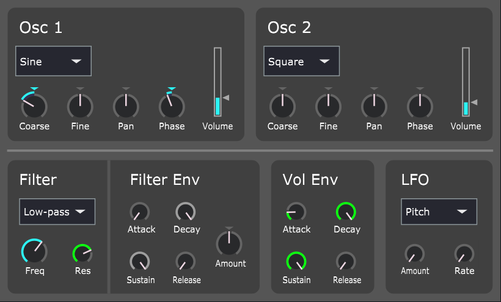

# About

A simple subtractive synthesiser. 

This project was created using [JUCE](https://juce.com/).

# Usage

## Oscillators

Two oscillators are provided, each with the ability to independently change:

- Oscillator waveform (Sine, Square, Saw)
- Coarse Pitch (-12 semitones to +12 semitones)
- Fine Pitch (-100 cents to +100 cents)
- Panning
- Phase
- Volume

Different phase offsets of the two oscillators relative to each other can be used to provide slightly different timbres.

## Filter

The filter can be set to either Low-pass or High-pass. The cutoff frequency and resonance of the filter can be adjusted.

Many thanks to Robert Bristow-Johnson for his [cookbook formulae](https://webaudio.github.io/Audio-EQ-Cookbook/audio-eq-cookbook.html) which I used in implementing the filter. 

The Filter Envelope ADSR parameters act upon the *filter cutoff frequency*. The Amount knob is an additional amount of Hz that are added or subtracted from the cutoff frequency, and the ADSR parameters change that amount over time.

## Volume Envelope

These are your standard ADSR parameters. Not much more to say here.

## LFO 

The LFO can target either one of the oscillator pitch or the filter cutoff frequency.

Oscillator pitch LFOs are frequently used to create a "vibrato" effect, whereas filter cutoff frequency LFOs are often used to create a sort of "pulsing" or "pumping" effect in the sound.

# Download

The `.vst3` file for the plugin can be found in the Releases tab on this repository.

# Build

The main requirement for this project is [JUCE](https://juce.com/). Any other requirements required to build it are ones that are needed to get any JUCE project working, i.e. a C++ compiler and a IDE compatible with JUCE.

A solution for the appropriate IDE can be generated by JUCE with the `NEASynthesiser.jucer` project file. This solution can then be built, where the `.vst3` file can be found in the `Builds` directory that will be generated.

